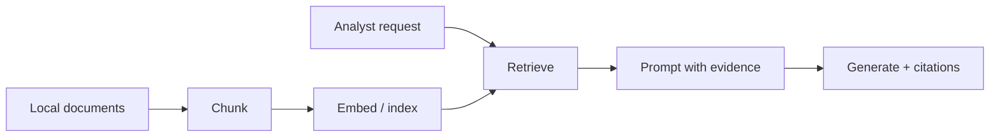

<!-- _class: lead -->
# RAG, fine-tuning & LLM evaluation
## Method selection for local threat-report Q&A
CYBER 207 · Week 13 · 90 minutes

---
# Measurable outcomes
- Trace chunk–embed–retrieve–generate stages.
- compare lexical, vector, and hybrid retrieval.
- choose prompting, RAG, or fine-tuning from task constraints.
- measure retrieval and generation separately.
- produce Project 4’s method-selection memo and evaluation report.

---
# Agenda — exact syllabus timing
| Time | Focus |
|---|---|
| 0–20 | Chunk, embed, retrieve, generate |
| 20–35 | Lexical, vector, hybrid retrieval |
| 35–50 | Prompting versus RAG versus fine-tuning |
| 50–70 | Retrieval and generation metrics *(50–55 break)* |
| 70–90 | Compare methods on threat-report Q&A / Project 4 |

---
# Visual recap · evidence moves through stages
<div class="ragflow"><span class="stage">CHUNK</span><span class="flowline"></span><span class="stage">RETRIEVE</span><span class="flowline"></span><span class="stage">CITE</span></div>

Every final claim retains a path back to supplied local evidence. Static export preserves the complete pipeline.

<!-- _notes: Use the animation to separate retrieval movement from generation. A final error may begin in chunking, ranking, context assembly, or generation. -->

---
# CYBER 207 boundary
We compare how methods use knowledge and how outputs are evaluated.

We do **not** duplicate CYBER 290 coverage of prompt attacks, red teaming, governance, secure deployment, or agent security.

All documents are supplied, sanitized, and local; no external systems are queried.

---
# Bounded defensive task
Answer analyst requests using a six-document synthetic threat-report collection.

Required output:
- concise answer;
- cited document IDs and spans;
- `insufficient_evidence` when unsupported;
- fixed category label where applicable.

Goal: evidence-grounded retrieval/generation—not autonomous action.

---
# RAG workflow


Evaluate each stage; a final error can originate upstream.

---
# Chunking
Chunk choices:
- fixed tokens with overlap;
- paragraph/section boundaries;
- metadata-aware segmentation;
- parent–child retrieval.

Tradeoff: small chunks improve precision but lose context; large chunks preserve context but dilute matching and consume window.

---
# Embeddings and similarity
Map query and chunk to vectors $q,d$.

Cosine similarity:
$$\cos(q,d)=\frac{q\cdot d}{\lVert q\rVert\lVert d\rVert}$$

High similarity suggests representational closeness—not truth, authority, or sufficient evidence.

---
# Retrieval top-$k$
Retrieve highest-scoring $k$ chunks.

- too small: miss supporting evidence;
- too large: add irrelevant context and cost;
- duplicate chunks reduce diversity;
- reranking can improve final ordering.

Tune $k$ on validation cases, not test cases.

---
# Metadata and provenance
Every chunk should retain:
- document ID/title;
- section and offsets;
- date/version;
- source category;
- stable text used for citation validation.

Provenance supports evaluation and analyst verification.

---
# Chunking demonstration
Given one sanitized report page:
1. mark three semantic boundaries;
2. apply an overlap policy;
3. identify a request needing adjacent context;
4. write metadata fields;
5. record one likely chunking failure.

Time: 5 minutes.

---
# Lexical retrieval
BM25-style methods reward query-term matches adjusted by document frequency and length.

Strengths:
- exact indicators/names;
- transparent matching;
- efficient baseline.

Weakness: vocabulary mismatch and paraphrase.

# Vector retrieval
Dense embeddings retrieve semantic similarity.

Strengths:
- paraphrase and conceptual matching;
- compact semantic representation.

Weaknesses:
- exact rare strings can be weak;
- similarity scores are model-dependent;
- harder to explain.

---
# Hybrid retrieval
Combine lexical and vector rankings/scores.

Reciprocal rank fusion example:
$$RRF(d)=\sum_m\frac{1}{k+r_m(d)}$$

Hybrid often balances exact and semantic matches. Fusion settings require validation.

---
# Retrieval comparison
| Query type | Lexical | Vector | Hybrid |
|---|---|---|---|
| exact event ID | strong | variable | strong |
| paraphrased behavior | weak/medium | strong | strong |
| mixed ID + concept | medium | medium | often strong |

Evidence decides; table is a hypothesis.

---
# Prompting only
Use when:
- required knowledge fits supplied context;
- knowledge is stable/small;
- behavior can be specified with examples/schema;
- no retrieval corpus is needed.

Limitation: prompt length and manual evidence selection.

# RAG
Use when:
- answers depend on changing/external-to-model documents;
- citations/provenance matter;
- corpus is larger than context;
- retrieval can be evaluated.

RAG changes context; it does not train model parameters.

# Fine-tuning
Use when repeated examples should adapt behavior, format, style, or specialized task mapping.

Fine-tuning is usually not the first choice for frequently changing factual knowledge.

Requires representative train/validation data and regression evaluation.

---
# Method-selection matrix
| Need | Prompt | RAG | Fine-tune |
|---|---|---|---|
| fresh document facts | limited | best fit | poor fit alone |
| citations | manual | natural fit | not guaranteed |
| repeated format behavior | good | good | strong candidate |
| low setup | best | medium | highest |

Combinations are possible; compare incrementally.

---
<!-- _class: lead -->
# 5-minute reset break
## 50–55 within evaluation
Return with one metric for retrieval and one for generation.

---
# Retrieval ground truth
For each evaluation case, annotate relevant chunk/document IDs.

At cutoff $k$:
$$Recall@k=\frac{|\text{relevant retrieved}|}{|\text{relevant}|}$$
$$Precision@k=\frac{|\text{relevant retrieved}|}{k}$$

Use multiple annotators or adjudication for ambiguous relevance.

---
# Ranking metrics
Reciprocal rank for first relevant result at rank $r$:
$$RR=1/r$$

Mean reciprocal rank averages over evaluation cases.

nDCG supports graded relevance and position discount. Always report corpus, cutoff, and judgment protocol.

---
# Generation metrics
Measure the required behavior:
- answer correctness against rubric;
- citation precision/recall;
- evidence entailment/faithfulness;
- completeness;
- abstention when unsupported;
- schema validity and consistency.

Separate style preference from factual/task success.

---
# End-to-end failure taxonomy
- no relevant chunk retrieved;
- relevant chunk ranked too low/truncated;
- evidence retrieved but ignored;
- unsupported claim added;
- citation points to wrong span;
- answer abstains despite sufficient evidence;
- output violates schema.

Tagging directs the next experiment.

---
# Evaluation-set design
Include:
- answerable and unanswerable cases;
- exact-term and paraphrase queries;
- single- and multi-document evidence;
- rare categories;
- time/version distinctions;
- predeclared train/validation/test split.

Avoid writing test cases after seeing outputs.

---
# Worked results
| method | Recall@5 | citation precision | answer score | abstain accuracy |
|---|---:|---:|---:|---:|
| prompt-only | — | .88 | .61 | .72 |
| lexical RAG | .74 | .91 | .70 | .78 |
| vector RAG | .82 | .84 | .73 | .75 |
| hybrid RAG | .89 | .90 | .79 | .81 |

Inspect uncertainty and errors before selecting hybrid.

---
# Guided activity · method comparison
Teams receive outputs for eight local Q&A cases.
1. score retrieval relevance;
2. validate citations/spans;
3. tag generation failure;
4. compare prompt-only, lexical, vector, hybrid;
5. recommend next experiment—not a universal winner.

Time: 12 minutes + 5-minute debrief.

---
# Fine-tuning evaluation plan
If proposing fine-tuning:
- define behavior gap that prompt/RAG did not solve;
- create representative train/validation examples;
- hold out task families/time slice;
- compare base versus tuned with same decoding;
- check regressions, calibration, and format;
- document cost and data provenance.

---
# Operational tradeoffs
- More retrieved context can reduce focus.
- Hybrid retrieval adds indexing/tuning complexity.
- Fine-tuning adds data and maintenance burden.
- Citations can be syntactically valid but unsupported.
- Method choice depends on update frequency, latency, evidence, and task stability.

---
# Common failure modes
1. Evaluate only final answer, not retrieval.
2. Tune $k$ on test cases.
3. Use embedding similarity as truth.
4. Fine-tune changing facts into parameters.
5. No unanswerable cases.
6. Citation IDs not span-validated.
7. Compare methods with different prompts/decoding unknowingly.

---
# Project 4 · deliverable
Compare prompting, retrieval, and adaptation for one bounded task.

Submit:
- local corpus/data sheet and evaluation set;
- prompt-only baseline;
- lexical and/or vector/hybrid retrieval;
- retrieval + generation metrics;
- failure taxonomy with examples;
- fine-tuning decision (experiment or justified rejection);
- method-selection memo and limitations.

---
# Project 4 · acceptance checks
- Test set frozen before final comparison.
- Relevance judgments documented.
- Retrieval and generation scored separately.
- Citations verified against local source spans.
- Unsupported cases test abstention.
- No CYBER 290 attack/deployment/governance content.
- Reproduction instructions include settings and seeds.

---
# Local deterministic retrieval · sklearn
```python
docs = ["host alpha repeated login failures",
  "host beta routine patch completed",
  "alpha account reset after verification"]
tfidf = TfidfVectorizer().fit(docs)
D, q = tfidf.transform(docs), tfidf.transform(["alpha login"])
scores = cosine_similarity(q, D).ravel()
top = scores.argsort()[::-1][:2]
nn = NearestNeighbors(metric="cosine", n_neighbors=2).fit(D)
dist, idx = nn.kneighbors(q)
```

The corpus and result are local, deterministic, inspectable, and suitable as a lexical baseline.

---
# Retrieval and adaptation field guide
| Control | Effect |
|---|---|
| `top_k` | evidence breadth and context load |
| `chunk_size`, `overlap` | precision versus continuity |
| similarity threshold | abstention and low-match filtering |
| `learning_rate`, epochs | adaptation step size and exposure |
| batch size | update noise and memory use |
| adapter rank, alpha | low-rank capacity and update scaling |

Freeze the test set. Tune retrieval and adaptation controls only with training and validation evidence.

---
# Next week continuity
Week 14 presents final projects.

Bring:
- decision contract;
- baseline and held-out evidence;
- one honest failure example;
- operational tradeoff;
- reproducible demo.

The strongest presentation will make its evidence boundary unmistakable.

---
# References and visual-design acknowledgment
- https://scikit-learn.org/stable/modules/generated/sklearn.feature_extraction.text.TfidfVectorizer.html
- https://scikit-learn.org/stable/modules/generated/sklearn.metrics.pairwise.cosine_similarity.html
- https://scikit-learn.org/stable/modules/generated/sklearn.neighbors.NearestNeighbors.html
- https://scikit-learn.org/stable/modules/model_evaluation.html
- https://huggingface.co/docs/transformers/training

Visual pedagogy was inspired by the general explanatory approaches of Deep Learning for Cyber, MLU-Explain, Distill, and official scikit-learn documentation. All wording, diagrams, HTML, CSS, and examples are original.
